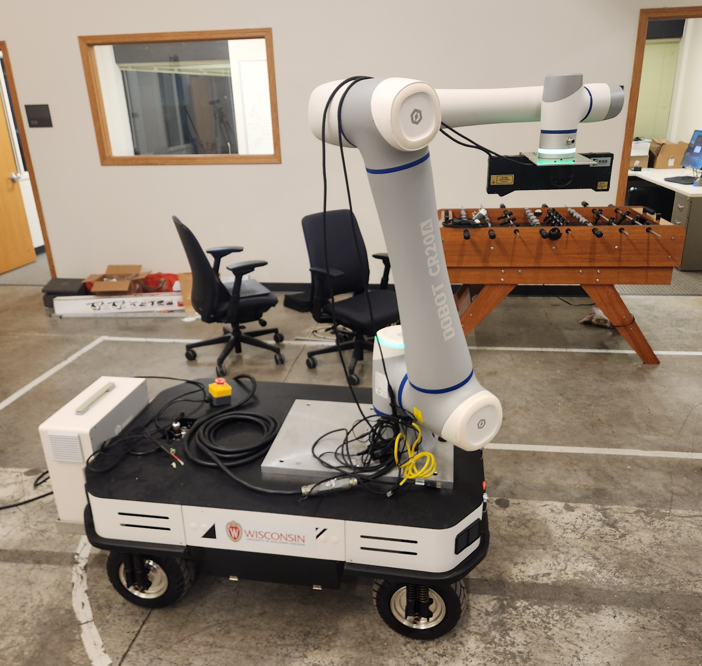
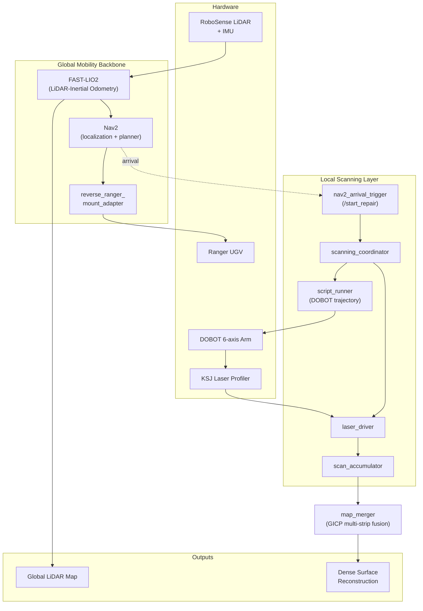
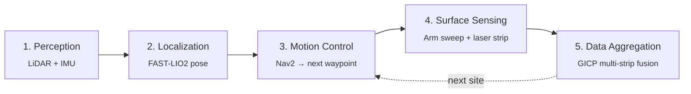
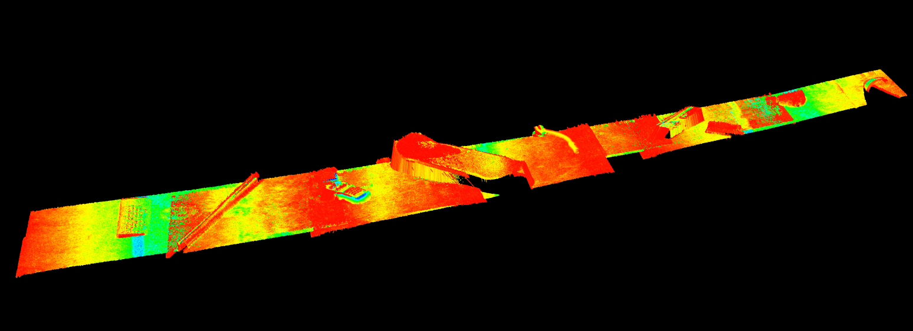

# Mobile Robotic System for Millimeter-Level 3D Surface Reconstruction

A ROS 2 platform that combines LiDAR-inertial autonomous navigation with industrial-grade laser profiling to reconstruct large surfaces at millimeter accuracy in previously unmapped environments.

---

## Project Overview

Mobile robots that map large workspaces with LiDAR SLAM typically achieve centimeter-level geometric accuracy — enough for navigation, but too coarse for inspection-grade surface analysis. Industrial laser triangulation sensors achieve millimeter-level accuracy, but are normally bolted to fixed gantries with a very limited reach. This project bridges that gap.

A 6-axis manipulator carrying a KSJ 3D laser profiler is mounted on a Ranger UGV. The UGV uses LiDAR-inertial odometry (FAST-LIO2) and Nav2 to drive itself between scan sites. At each site, the manipulator executes constant-velocity scan sweeps, and the resulting dense profile strips are fused via Generalized ICP into a globally consistent surface. The pipeline produces two outputs simultaneously: a LiDAR-derived global map for navigation and a laser-derived millimeter-accurate local reconstruction.



### System Architecture

The hardware and software layers are decoupled into a **global mobility backbone** (handles localization and navigation) and a **local scanning layer** (handles dense surface acquisition). A **multi-strip fusion** stage stitches the two together into a single coherent reconstruction.



### Workflow

End-to-end the system runs as a five-stage pipeline that loops at every scan site. The robot perceives its surroundings, localizes itself, navigates to the next waypoint, the arm performs a controlled laser sweep, and the captured strips are aggregated into a globally consistent point cloud before moving on.



The resulting reconstructions preserve sub-centimeter surface detail across multi-meter scans:



### Stack

- **ROS 2 Humble** on Ubuntu 22.04
- **Hardware**: AgileX Ranger UGV, DOBOT CR-series 6-axis arm, KSJ UC3D230ED laser profiler, RoboSense LiDAR, 9-DOF IMU
- **Perception / SLAM**: FAST-LIO2 (LiDAR–inertial odometry)
- **Navigation**: Nav2
- **Reconstruction**: PCL + `small_gicp` for Generalized ICP fusion
- **Custom packages**: `surface_reconstruction`, `laser_scanner`, `robot_arm` (C++ and Python)

---

## Onboarding Guide
### 1. Prerequisites

- Ubuntu 22.04
- ROS 2 Humble installed system-wide (`/opt/ros/humble`)
- ~5 GB free disk for the workspace + dependencies
- Hardware bench access for end-to-end testing (laser profiler over USB, Ranger UGV over CAN-to-USB, DOBOT arm over Ethernet, RoboSense LiDAR over Ethernet)

### 2. Setup

```bash
git clone <repo-url>
cd Dobot_Robot_Arm

# Installs ROS deps and pulls all third-party packages into src/
./install.sh

# Build the workspace
colcon build --symlink-install

# Source in every new shell
source ./setup.sh
```

The third-party packages are **not** committed to this repo. [install.sh](install.sh) calls `vcs import src < dependencies.repos` to pull them at the pinned commits listed in [dependencies.repos](dependencies.repos). If you ever need to update a pinned commit, edit that file and re-run `vcs import src < dependencies.repos`.

### 3. Repository Layout

```
Dobot_Robot_Arm/
├── dependencies.repos            # vcstool manifest for all 3rd-party ROS packages
├── install.sh                    # one-shot env + dependency installer
├── setup.sh                      # per-shell env setup (source it)
├── laser_scanner.rviz            # RViz config for visualizing the merged cloud
├── test_scanner_heights.sh       # helper for calibrating profiler standoff
│
├── src/
│   ├── surface_reconstruction/   # ORIGINAL — top-level system orchestrator
│   ├── laser_scanner/            # ORIGINAL — KSJ driver + accumulator + GICP fusion
│   ├── robot_arm/                # ORIGINAL — scanning trajectory script runner
│   ├── image_processing/         # LEGACY  — earlier vision-based line follower
│   └── ranger_control/           # LEGACY  — earlier vision-based UGV controller
│
├── blocks/                       # post-processing scripts for offline cloud merging
└── scans/                        # output dir for saved .pcd / .ply (gitignored)
```

After `vcs import src < dependencies.repos` runs, `src/` will also contain: `DOBOT_6Axis_ROS2_V4`, `ranger_ros2`, `ugv_sdk`, `rslidar_sdk`, `rslidar_msg`, `small_gicp` (and optionally `OrbbecSDK_ROS2`).

### 4. Running the System

#### Full pipeline (typical)

```bash
source ./setup.sh
ros2 launch surface_reconstruction system_bringup.launch.py
```

This single launch starts everything defined in [src/surface_reconstruction/launch/system_bringup.launch.py](src/surface_reconstruction/launch/system_bringup.launch.py):

| Subsystem            | Package / Node                                     |
| -------------------- | -------------------------------------------------- |
| URDF / TF tree       | `robot_state_publisher`                            |
| LiDAR driver         | `rslidar_sdk` (publishes `/rslidar_points`)        |
| LiDAR → laser scan   | `pointcloud_to_laserscan`                          |
| Mobile base          | `ranger_base` + `reverse_ranger_mount_adapter`     |
| Navigation           | `nav2_bringup` localization + navigation           |
| Robotic arm          | `cr_robot_ros2` (`dobot_bringup_ros2.launch.py`)   |
| Laser profiler stack | `laser_scanner/scanner_system.launch.py`           |
| Arrival → repair     | `surface_reconstruction/nav2_arrival_trigger`      |

The launch publishes `/start_repair` (`std_msgs/Bool`) whenever Nav2 reports an arrival; downstream nodes (e.g. the scanning coordinator) subscribe to this to start a sweep.

#### Enable the DOBOT arm (required after bringup)

The arm starts in a **disabled** state after `dobot_bringup_ros2` launches — joint motion will be rejected until you explicitly enable it. From a second terminal (after sourcing the workspace):

```bash
# 1. (Optional) Power on the controller if it's off
ros2 service call /dobot_bringup_ros2/srv/PowerOn dobot_msgs_v4/srv/PowerOn "{}"

# 2. Clear any fault state from a previous run
ros2 service call /dobot_bringup_ros2/srv/ClearError dobot_msgs_v4/srv/ClearError "{}"

# 3. Enable the arm (required before any motion)
ros2 service call /dobot_bringup_ros2/srv/EnableRobot dobot_msgs_v4/srv/EnableRobot "{}"
```

When you're done, disable it:

```bash
ros2 service call /dobot_bringup_ros2/srv/DisableRobot dobot_msgs_v4/srv/DisableRobot "{}"
```

If the arm faults during operation (red error light, motion stops), run `ClearError` then `EnableRobot` again to recover.

#### Manual control during a scan

Useful services exposed by [src/laser_scanner](src/laser_scanner):

```bash
# Tell the accumulator to save the current merged cloud to disk
ros2 service call /scanner/save_merged_cloud std_srvs/srv/Trigger
ros2 service call /scanner/clear_scans      std_srvs/srv/Empty
ros2 service call /scanner/get_scan_count   std_srvs/srv/Trigger

# Promote the latest accumulated scan into the global world map
ros2 service call /map_merger/add_block std_srvs/srv/Trigger
ros2 service call /map_merger/save      std_srvs/srv/Trigger
ros2 service call /map_merger/reset     std_srvs/srv/Empty
```

Output `.pcd` files are written under `~/Dobot_Robot_Arm/scans/` (overridable via the `output_directory` launch arg).

#### Offline post-processing

[blocks/](blocks/) contains standalone Python tools for merging saved `.pcd` blocks with a more sophisticated multi-scale GICP cascade:

```bash
python blocks/merge_blocks.py     # merge per-position scan blocks
python blocks/interactive_merge.py  # GUI-assisted alignment
```

### 5. Code Map (where to look when…)

| Goal                                                  | Start here                                                                                       |
| ----------------------------------------------------- | ------------------------------------------------------------------------------------------------ |
| Add or remove a subsystem in the bringup              | [src/surface_reconstruction/launch/system_bringup.launch.py](src/surface_reconstruction/launch/system_bringup.launch.py) |
| Change the robot's TF tree / link offsets             | [src/surface_reconstruction/urdf/surface_reconstruction.urdf](src/surface_reconstruction/urdf/surface_reconstruction.urdf) |
| Tune Nav2 (costmaps, planner, controller)             | [src/surface_reconstruction/config/nav2_params.yaml](src/surface_reconstruction/config/nav2_params.yaml) |
| Change LiDAR settings (channel filtering, IP, etc.)   | [src/surface_reconstruction/config/rslidar_config.yaml](src/surface_reconstruction/config/rslidar_config.yaml) |
| Change how Nav2 arrival triggers a scan               | [src/surface_reconstruction/src/nav2_arrival_trigger.cpp](src/surface_reconstruction/src/nav2_arrival_trigger.cpp) |
| Reverse the Ranger's "front" for Nav2                 | [src/surface_reconstruction/src/reverse_ranger_mount_adapter.cpp](src/surface_reconstruction/src/reverse_ranger_mount_adapter.cpp) |
| Talk to the KSJ laser profiler (C/C++ SDK calls)     | [src/laser_scanner/src/laser_driver.cpp](src/laser_scanner/src/laser_driver.cpp) |
| Accumulate / fuse strips into a single cloud          | [src/laser_scanner/src/scan_accumulator.cpp](src/laser_scanner/src/scan_accumulator.cpp), [src/laser_scanner/src/map_merger.cpp](src/laser_scanner/src/map_merger.cpp) |
| Coordinate arm sweep ↔ scan trigger                   | [src/laser_scanner/src/scanning_coordinator.cpp](src/laser_scanner/src/scanning_coordinator.cpp) |
| Run a saved DOBOT script during a scan                | [src/robot_arm/src/script_runner.cpp](src/robot_arm/src/script_runner.cpp) |

The Python equivalents under [src/laser_scanner/laser_scanner/](src/laser_scanner/laser_scanner/) mirror the C++ nodes — the launch defaults to C++ (`use_cpp:=true`) for performance, but the Python versions are easier to prototype changes in.
